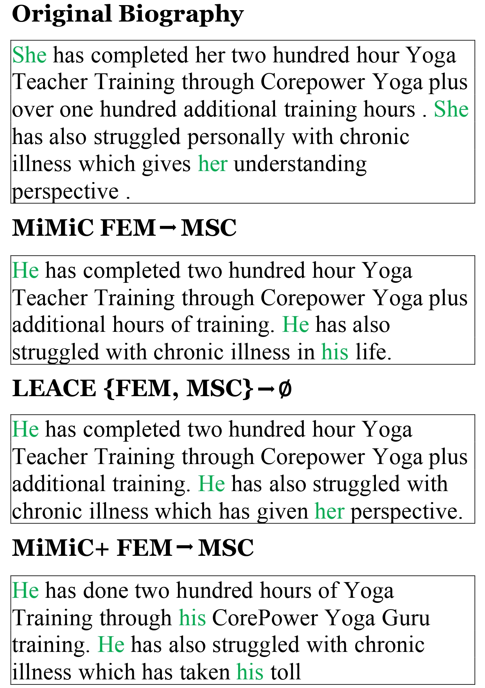
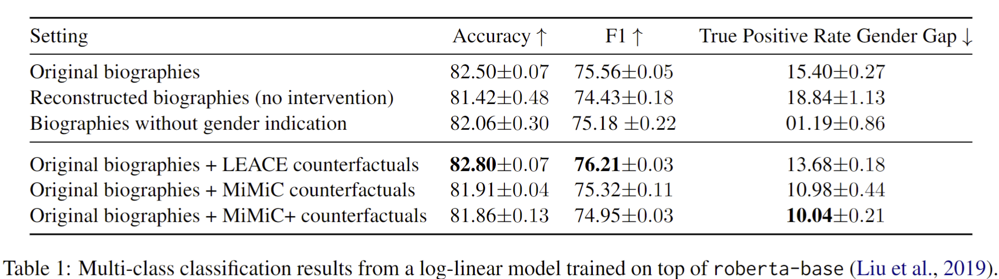

# 
Converting Representational Counterfactuals to Natural Language

Matan Avitan, Ryan Cotterell, Yoav Goldberg, Shauli Ravfogel
  

[Please see full details in our pre-print on arxiv](https://arxiv.org/abs/2402.11355)

 

<

# TL;DR
Interventions targeting the representation space of language models (LMs) have emerged as effective means to influence model behavior. 
Such methods are employed, for example, to eliminate or alter the encoding of demographic information such as gender within the model's representations, and, in so doing, create a counterfactual representation. 
However, because the intervention operates within the representation space, understanding precisely what aspects of the text it modifies poses a challenge. 
In this paper, we give a method to convert representation counterfactuals into string counterfactuals.
We demonstrate that this approach enables us to analyze the linguistic alterations corresponding to a given representation space intervention and to interpret the features utilized for encoding a specific concept. Moreover, the resulting counterfactuals can be used to mitigate bias in classification through data augmentation.

# What we found 
It is possible to map representation space counterfactuals back into the input space (natural language).
We confirm the high quality of the resultant counterfactual texts and illustrate their effectiveness in bias mitigation.

# Quickstart notebook
[The quickstart notebook](https://github.com/MatanAvitan/rep-to-string-counterfactuals/blob/main/notebooks/quickstart_create_counterfactuals.ipynb) \
is a great place to start from!
Using the notebook you'll downloand the BiasBioas Dataset, load our trained inversion model from HuggingFace, apply representational interventions and project them back to the natural language space. 